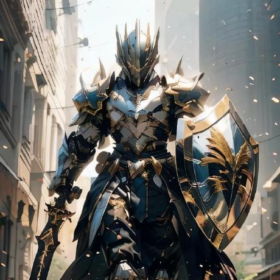

<!--
  IDENTITY
  Chinese name: 沈晓昱
  Pinyin, Chinese order: Shěn Xiǎoyù
  English order: Xiaoyu Shen
  GitHub username: XiaoyuShenDev

  REQUIRED LOCAL ASSET
  ./assets/xiaoyu-obsidian-vanguard.jpg

  OPTIONAL DYNAMIC ASSET
  The Golden Dragon Trail is generated by:
  ./.github/workflows/golden-dragon.yml
-->

<!-- ═══════════════════════ MYTHIC HEADER ═══════════════════════ -->

  

<h1>沈晓昱</h1>

<h3>
  Shěn Xiǎoyù
  &nbsp; ◆ &nbsp;
  Xiaoyu Shen
</h3>

  
  
  

<h3>
  ❝ <i>The only way to go fast is to go well.</i> ❞
</h3>

 

 

<!-- ═══════════════════════ THE OATH / ABOUT ═══════════════════════ -->

<h2>⚔ THE OATH · 关于我</h2>

  <i><b>
    Welcome! I am a software artisan dedicated to the craft of programming.
    I focus on writing self-documenting, modular code that future teams can
    easily maintain and expand upon.
  </b></i>

 

<!-- ═══════════════════════ THE ARSENAL / STACK ═══════════════════════ -->

<h2>🛡 THE ARSENAL · 技术栈</h2>

  
  
  
  
   
  
  
  
  

 

<!-- ═══════════════════════ BATTLE DISCIPLINES ═══════════════════════ -->

<h2>🔥 BATTLE DISCIPLINES · 程序员动态</h2>

  
  
  

 

<!-- ═══════════════════════ WAR CHRONICLE ═══════════════════════ -->

<h2>♜ WAR CHRONICLE · 数据总览</h2>

  
  

 

  

  

 

<!-- ═══════════════════════ HALL OF RENOWN ═══════════════════════ -->

<h2>♛ HALL OF RENOWN · GITHUB 成就</h2>

  

<!-- ═══════════════════════ GOLDEN DRAGON TRAIL ═══════════════════════ -->

<h2>🐉 GOLDEN DRAGON TRAIL · 贡献轨迹</h2>

  <picture>
    <source
      media="(prefers-color-scheme: dark)"
      srcset="https://raw.githubusercontent.com/XiaoyuShenDev/XiaoyuShenDev/output/golden-dragon.svg"
    />
    <source
      media="(prefers-color-scheme: light)"
      srcset="https://raw.githubusercontent.com/XiaoyuShenDev/XiaoyuShenDev/output/golden-dragon.svg"
    />
    
  </picture>

 

 

<!-- ═══════════════════════ SIGNATURE ═══════════════════════ -->

<h3>
  沈晓昱
  &nbsp; ◆ &nbsp;
  <i>Shěn Xiǎoyù</i>
  &nbsp; ◆ &nbsp;
  Xiaoyu Shen
</h3>

  

